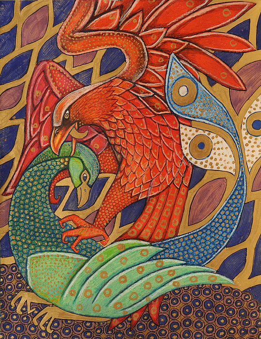
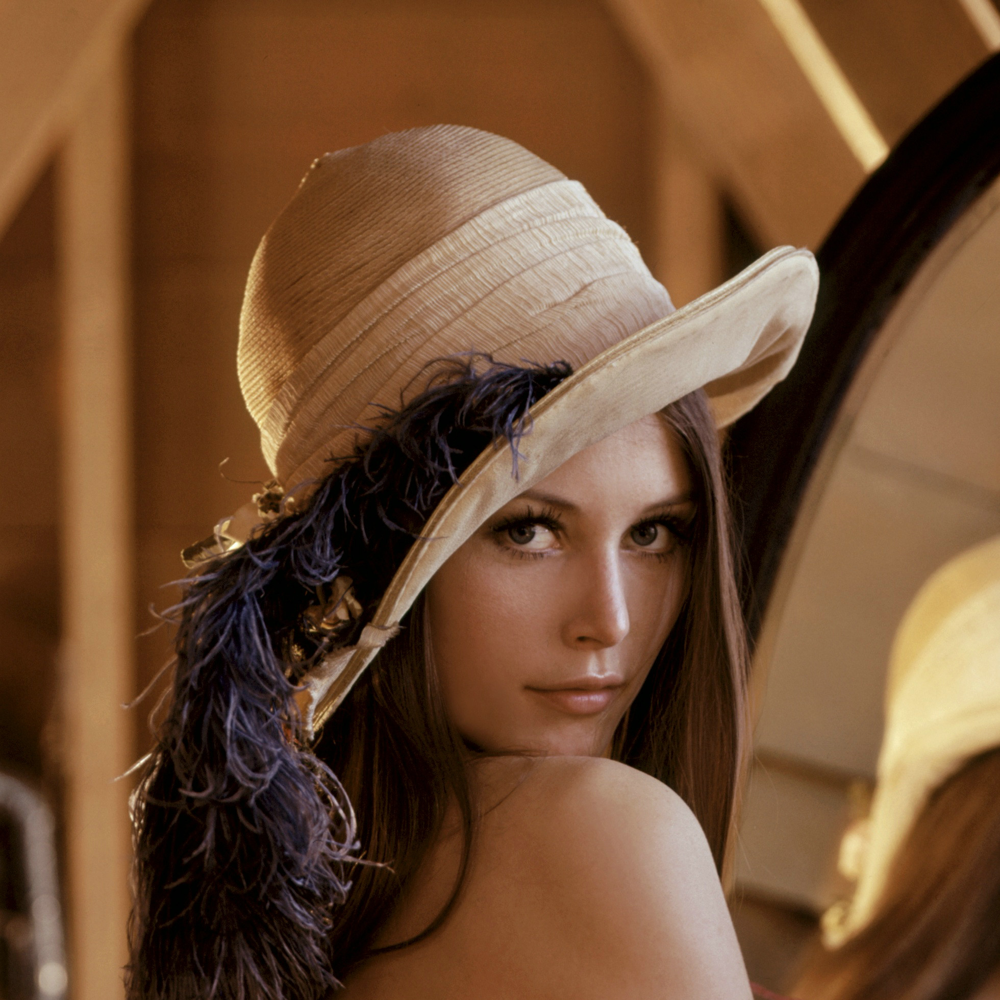

## Style It!

Style images with convolutional neural nets with *online* parameters tuning.
"Static" realization based on Stanford cs231n/assignment3/ StyleTransfer with Tensorflow notebook.

Run with `python main.py` from terminal.
Main command line arguments:

    --default-style-decay - default value for style importance.
    --default-content-weight - default value for content importance.
    --content-max-side - max side of content image.
    --style-max-side  - max side of style image.
    --save-each - step size for saving progress.
    --update-each - step size for updating result.

#### Usage example:

#### Generated samples:
<table>
    <tr>
        <th>Content</th>
        <th>Style</th>
        <th>Progress</th>
    </tr>
    <tr>
        <td> </td>
        <td> </td>
        <td>
              
              
        </td>
    </tr>
    <tr>
        <td> </td>
        <td> </td>
        <td>   </td>
    </tr>
    <tr>
        <td> </td>
        <td> </td>
        <td>   </td>
    </tr>
</table>
